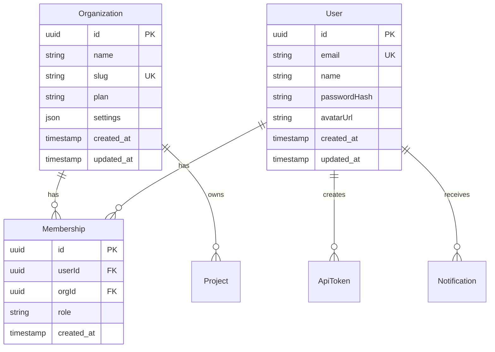
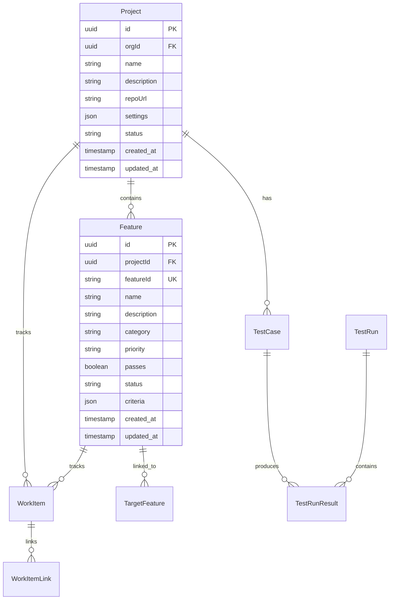
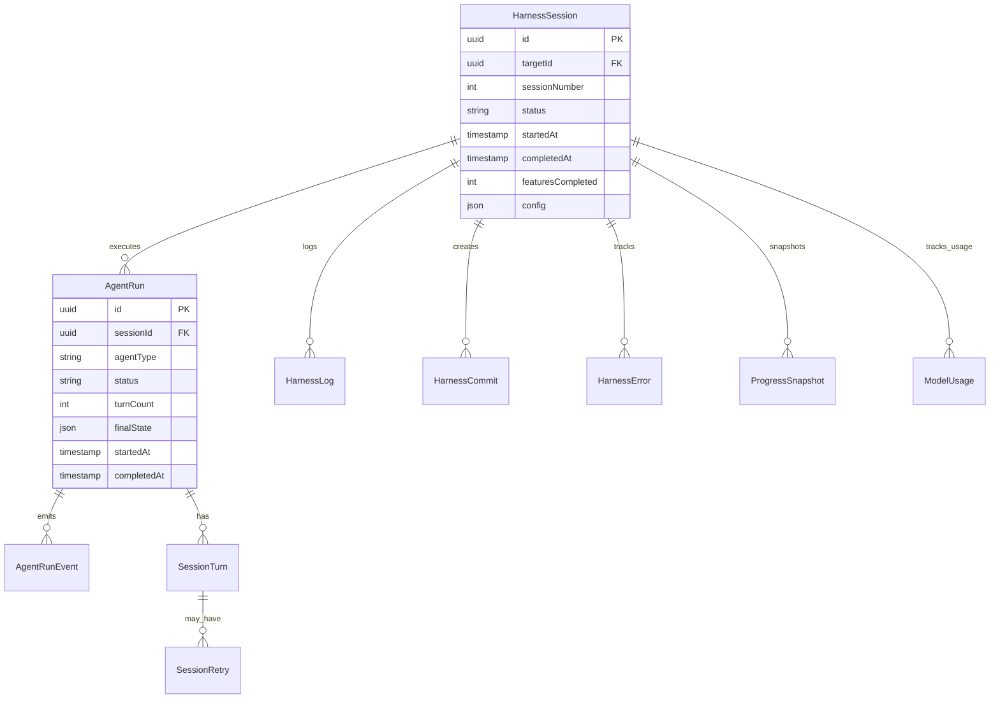
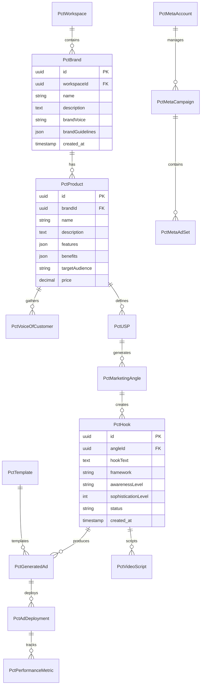
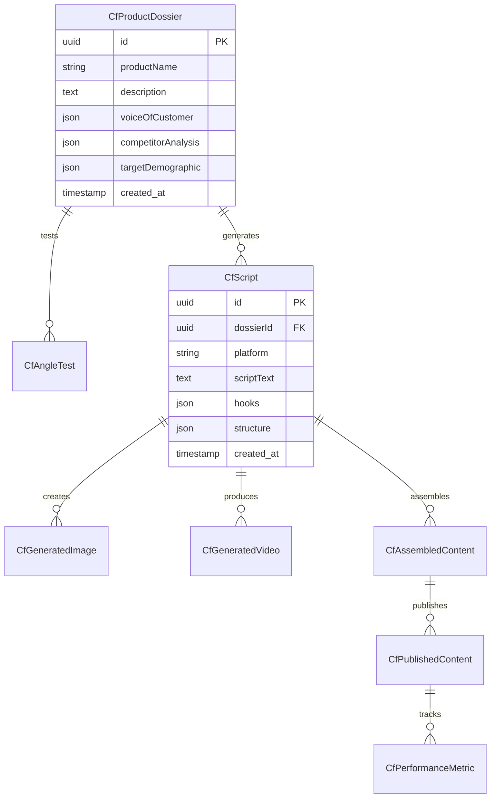

# Database Schema Documentation

**Last Updated:** 2026-03-01
**Database:** PostgreSQL with Prisma ORM
**Total Models:** 86

## Table of Contents

1. [Overview](#overview)
2. [Entity Relationship Diagram](#entity-relationship-diagram)
3. [Core System Models](#core-system-models)
4. [Project & Feature Management](#project--feature-management)
5. [Agent & Harness System](#agent--harness-system)
6. [PCT (Programmatic Creative Testing)](#pct-programmatic-creative-testing)
7. [CF (Content Factory)](#cf-content-factory)
8. [Git Integration](#git-integration)
9. [Indexes & Performance](#indexes--performance)
10. [Data Relationships](#data-relationships)

---

## Overview

This database schema supports three major systems:

1. **Autonomous Coding Dashboard (ACD)** - Agent harness, feature tracking, project management
2. **Programmatic Creative Testing (PCT)** - Facebook ad creative generation and testing
3. **Content Factory (CF)** - Multi-platform content production system

All systems share core infrastructure (users, organizations, notifications) while maintaining domain-specific tables.

---

## Entity Relationship Diagram

### Core System



### Project & Feature Management



### Agent & Harness System



### PCT (Programmatic Creative Testing)



### CF (Content Factory)



---

## Core System Models

### Organization
**Table:** `organizations`
**Purpose:** Multi-tenant organization container

| Column | Type | Constraints | Description |
|--------|------|-------------|-------------|
| id | UUID | PK | Primary identifier |
| name | VARCHAR(255) | NOT NULL | Organization name |
| slug | VARCHAR(100) | UNIQUE | URL-safe identifier |
| plan | VARCHAR(50) | DEFAULT 'free' | Subscription plan |
| settings | JSON | DEFAULT '{}' | Org-level settings |
| created_at | TIMESTAMPTZ | DEFAULT now() | Creation timestamp |
| updated_at | TIMESTAMPTZ | DEFAULT now() | Last update timestamp |

**Relationships:**
- Has many: Memberships, Projects

---

### User
**Table:** `users`
**Purpose:** User accounts and authentication

| Column | Type | Constraints | Description |
|--------|------|-------------|-------------|
| id | UUID | PK | Primary identifier |
| email | VARCHAR(255) | UNIQUE, NOT NULL | User email (login) |
| name | VARCHAR(255) | NOT NULL | Display name |
| passwordHash | VARCHAR(255) | NULL | Bcrypt hashed password |
| avatarUrl | VARCHAR(500) | NULL | Profile image URL |
| created_at | TIMESTAMPTZ | DEFAULT now() | Account creation date |
| updated_at | TIMESTAMPTZ | DEFAULT now() | Last profile update |

**Relationships:**
- Has many: Memberships, ApiTokens, Notifications

---

### Membership
**Table:** `memberships`
**Purpose:** User-Organization relationships with roles

| Column | Type | Constraints | Description |
|--------|------|-------------|-------------|
| id | UUID | PK | Primary identifier |
| userId | UUID | FK → users, NOT NULL | User reference |
| orgId | UUID | FK → organizations, NOT NULL | Organization reference |
| role | VARCHAR(50) | DEFAULT 'member' | Role: owner, admin, member |
| created_at | TIMESTAMPTZ | DEFAULT now() | Join date |

**Unique Constraint:** (userId, orgId)

**Relationships:**
- Belongs to: User, Organization

---

### ApiToken
**Table:** `api_tokens`
**Purpose:** API authentication tokens

| Column | Type | Constraints | Description |
|--------|------|-------------|-------------|
| id | UUID | PK | Primary identifier |
| userId | STRING | FK → users | Token owner |
| name | STRING | NOT NULL | Human-readable name |
| tokenHash | STRING | NOT NULL | Hashed token value |
| scopes | JSON | DEFAULT '[]' | Permission scopes |
| lastUsedAt | TIMESTAMP | NULL | Last usage timestamp |
| created_at | TIMESTAMP | DEFAULT now() | Creation date |
| expiresAt | TIMESTAMP | NULL | Expiration date |

**Relationships:**
- Belongs to: User

---

## Project & Feature Management

### Project
**Table:** `projects`
**Purpose:** Software projects being built/tracked

| Column | Type | Constraints | Description |
|--------|------|-------------|-------------|
| id | UUID | PK | Primary identifier |
| orgId | UUID | FK → organizations | Owner organization |
| name | VARCHAR(255) | NOT NULL | Project name |
| description | TEXT | NULL | Project description |
| repoUrl | VARCHAR(500) | NULL | Git repository URL |
| branch | VARCHAR(100) | DEFAULT 'main' | Primary branch |
| settings | JSON | DEFAULT '{}' | Project settings |
| status | VARCHAR(50) | DEFAULT 'active' | Project status |
| metadata | JSON | DEFAULT '{}' | Additional data |
| created_at | TIMESTAMPTZ | DEFAULT now() | Creation date |
| updated_at | TIMESTAMPTZ | DEFAULT now() | Last update |

**Relationships:**
- Belongs to: Organization
- Has many: Features, WorkItems, TestCases, ProjectSpecs, Repos

---

### Feature
**Table:** `features`
**Purpose:** Individual feature specifications and status

| Column | Type | Constraints | Description |
|--------|------|-------------|-------------|
| id | UUID | PK | Primary identifier |
| projectId | UUID | FK → projects | Parent project |
| featureId | VARCHAR(100) | UNIQUE | Feature identifier (e.g., PCT-WC-001) |
| name | VARCHAR(255) | NOT NULL | Feature name |
| description | TEXT | NULL | Feature description |
| category | VARCHAR(100) | NULL | Feature category |
| priority | VARCHAR(20) | NULL | Priority level (P0-P3) |
| passes | BOOLEAN | DEFAULT false | Pass/fail status |
| status | VARCHAR(50) | DEFAULT 'pending' | Current status |
| criteria | JSON | NULL | Acceptance criteria |
| effort | VARCHAR(20) | NULL | Estimated effort |
| dependencies | JSON | DEFAULT '[]' | Feature dependencies |
| created_at | TIMESTAMPTZ | DEFAULT now() | Creation date |
| updated_at | TIMESTAMPTZ | DEFAULT now() | Last update |

**Unique Constraint:** (projectId, featureId)

**Relationships:**
- Belongs to: Project
- Has many: WorkItems, TargetFeatures

---

### WorkItem
**Table:** `work_items`
**Purpose:** Tasks and issues for features

| Column | Type | Constraints | Description |
|--------|------|-------------|-------------|
| id | UUID | PK | Primary identifier |
| projectId | UUID | FK → projects | Parent project |
| featureId | UUID | FK → features, NULL | Related feature |
| title | VARCHAR(255) | NOT NULL | Work item title |
| description | TEXT | NULL | Detailed description |
| type | VARCHAR(50) | NOT NULL | Type: task, bug, enhancement |
| status | VARCHAR(50) | DEFAULT 'todo' | Status: todo, in_progress, done |
| priority | VARCHAR(20) | NULL | Priority level |
| assigneeId | UUID | FK → users, NULL | Assigned user |
| effort | INT | NULL | Story points |
| metadata | JSON | DEFAULT '{}' | Additional data |
| created_at | TIMESTAMPTZ | DEFAULT now() | Creation date |
| updated_at | TIMESTAMPTZ | DEFAULT now() | Last update |

**Relationships:**
- Belongs to: Project, Feature (optional), User (assignee)
- Has many: WorkItemLinks

---

## Agent & Harness System

### HarnessSession
**Table:** `harness_sessions`
**Purpose:** Tracks autonomous coding agent sessions

| Column | Type | Constraints | Description |
|--------|------|-------------|-------------|
| id | UUID | PK | Primary identifier |
| targetId | UUID | FK → targets | Target configuration |
| sessionNumber | INT | NOT NULL | Sequential session number |
| status | VARCHAR(50) | NOT NULL | Session status |
| startedAt | TIMESTAMPTZ | NOT NULL | Start time |
| completedAt | TIMESTAMPTZ | NULL | Completion time |
| featuresCompleted | INT | DEFAULT 0 | Features completed |
| featuresPassed | INT | DEFAULT 0 | Features passed |
| testsPassed | INT | DEFAULT 0 | Tests passed |
| commitCount | INT | DEFAULT 0 | Commits created |
| errorCount | INT | DEFAULT 0 | Errors encountered |
| config | JSON | DEFAULT '{}' | Session config |
| outcome | VARCHAR(50) | NULL | Final outcome |
| metadata | JSON | DEFAULT '{}' | Session metadata |

**Relationships:**
- Belongs to: Target
- Has many: AgentRuns, HarnessLogs, HarnessCommits, HarnessErrors, ProgressSnapshots

---

### AgentRun
**Table:** `agent_runs`
**Purpose:** Individual agent execution within a session

| Column | Type | Constraints | Description |
|--------|------|-------------|-------------|
| id | UUID | PK | Primary identifier |
| sessionId | UUID | FK → harness_sessions | Parent session |
| agentType | VARCHAR(50) | NOT NULL | Agent type: initializer, coding |
| status | VARCHAR(50) | NOT NULL | Run status |
| startedAt | TIMESTAMPTZ | NOT NULL | Start time |
| completedAt | TIMESTAMPTZ | NULL | End time |
| turnCount | INT | DEFAULT 0 | Number of turns |
| finalState | JSON | NULL | Final agent state |
| error | TEXT | NULL | Error message if failed |
| metadata | JSON | DEFAULT '{}' | Run metadata |

**Relationships:**
- Belongs to: HarnessSession
- Has many: AgentRunEvents, SessionTurns

---

### ProgressSnapshot
**Table:** `progress_snapshots`
**Purpose:** Point-in-time feature progress tracking

| Column | Type | Constraints | Description |
|--------|------|-------------|-------------|
| id | UUID | PK | Primary identifier |
| sessionId | UUID | FK → harness_sessions | Session reference |
| timestamp | TIMESTAMPTZ | NOT NULL | Snapshot time |
| featuresTotal | INT | NOT NULL | Total features |
| featuresCompleted | INT | NOT NULL | Completed features |
| featuresPassed | INT | NOT NULL | Passed features |
| velocity | DECIMAL | NULL | Features per hour |
| estimatedTimeRemaining | INT | NULL | Minutes remaining |
| metadata | JSON | DEFAULT '{}' | Additional metrics |

**Relationships:**
- Belongs to: HarnessSession

---

## PCT (Programmatic Creative Testing)

### PctWorkspace
**Table:** `pct_workspaces`
**Purpose:** Isolated workspace for PCT campaigns

| Column | Type | Constraints | Description |
|--------|------|-------------|-------------|
| id | UUID | PK | Primary identifier |
| name | VARCHAR(255) | NOT NULL | Workspace name |
| userId | UUID | FK → users | Owner |
| settings | JSON | DEFAULT '{}' | Workspace settings |
| created_at | TIMESTAMPTZ | DEFAULT now() | Creation date |

**Relationships:**
- Has many: PctBrands, PctUsers

---

### PctBrand
**Table:** `pct_brands`
**Purpose:** Brand profiles for ad campaigns

| Column | Type | Constraints | Description |
|--------|------|-------------|-------------|
| id | UUID | PK | Primary identifier |
| workspaceId | UUID | FK → pct_workspaces | Parent workspace |
| name | VARCHAR(255) | NOT NULL | Brand name |
| description | TEXT | NULL | Brand description |
| brandVoice | VARCHAR(255) | NULL | Voice/tone descriptor |
| brandValues | TEXT | NULL | Core values |
| toneStyle | VARCHAR(100) | NULL | Tone category |
| logoUrl | VARCHAR(500) | NULL | Logo image URL |
| brandGuidelines | JSON | NULL | Colors, fonts, etc. |
| created_at | TIMESTAMPTZ | DEFAULT now() | Creation date |
| updated_at | TIMESTAMPTZ | DEFAULT now() | Last update |

**Relationships:**
- Belongs to: PctWorkspace
- Has many: PctProducts

---

### PctProduct
**Table:** `pct_products`
**Purpose:** Products within a brand

| Column | Type | Constraints | Description |
|--------|------|-------------|-------------|
| id | UUID | PK | Primary identifier |
| brandId | UUID | FK → pct_brands | Parent brand |
| name | VARCHAR(255) | NOT NULL | Product name |
| description | TEXT | NULL | Product description |
| features | JSON | NULL | Product features list |
| benefits | JSON | NULL | Product benefits list |
| targetAudience | TEXT | NULL | Target audience description |
| pricePoint | DECIMAL(10,2) | NULL | Price |
| category | VARCHAR(100) | NULL | Product category |
| imageUrl | VARCHAR(500) | NULL | Product image URL |
| created_at | TIMESTAMPTZ | DEFAULT now() | Creation date |
| updated_at | TIMESTAMPTZ | DEFAULT now() | Last update |

**Relationships:**
- Belongs to: PctBrand
- Has many: PctVoiceOfCustomer, PctUSPs

---

### PctUSP (Unique Selling Proposition)
**Table:** `pct_usps`
**Purpose:** Core value propositions for products

| Column | Type | Constraints | Description |
|--------|------|-------------|-------------|
| id | UUID | PK | Primary identifier |
| productId | UUID | FK → pct_products | Parent product |
| uspText | TEXT | NOT NULL | USP statement |
| source | VARCHAR(50) | DEFAULT 'manual' | Source: manual, ai_generated |
| aiModel | VARCHAR(100) | NULL | AI model used if generated |
| isPrimary | BOOLEAN | DEFAULT false | Primary USP flag |
| created_at | TIMESTAMPTZ | DEFAULT now() | Creation date |

**Relationships:**
- Belongs to: PctProduct
- Has many: PctMarketingAngles

---

### PctMarketingAngle
**Table:** `pct_marketing_angles`
**Purpose:** Marketing angles derived from USPs

| Column | Type | Constraints | Description |
|--------|------|-------------|-------------|
| id | UUID | PK | Primary identifier |
| uspId | UUID | FK → pct_usps | Parent USP |
| angleText | TEXT | NOT NULL | Marketing angle statement |
| created_at | TIMESTAMPTZ | DEFAULT now() | Creation date |

**Relationships:**
- Belongs to: PctUSP
- Has many: PctHooks

---

### PctHook
**Table:** `pct_hooks`
**Purpose:** Ad copy hooks generated from angles

| Column | Type | Constraints | Description |
|--------|------|-------------|-------------|
| id | UUID | PK | Primary identifier |
| angleId | UUID | FK → pct_marketing_angles | Parent angle |
| hookText | TEXT | NOT NULL | Hook copy text |
| framework | VARCHAR(100) | NULL | Framework: punchy, bold_statements, etc. |
| awarenessLevel | VARCHAR(50) | NULL | Awareness level 1-5 |
| sophisticationLevel | INT | NULL | Market sophistication 1-5 |
| status | VARCHAR(50) | DEFAULT 'pending_review' | Status: pending_review, approved, rejected |
| reviewNotes | TEXT | NULL | Review feedback |
| aiModel | VARCHAR(100) | NULL | AI model used |
| aiPrompt | TEXT | NULL | Prompt used for generation |
| created_at | TIMESTAMPTZ | DEFAULT now() | Creation date |
| reviewed_at | TIMESTAMPTZ | NULL | Review timestamp |

**Relationships:**
- Belongs to: PctMarketingAngle
- Has many: PctGeneratedAds, PctVideoScripts

---

### PctTemplate
**Table:** `pct_templates`
**Purpose:** Visual templates for ad generation

| Column | Type | Constraints | Description |
|--------|------|-------------|-------------|
| id | UUID | PK | Primary identifier |
| workspaceId | UUID | FK → pct_workspaces | Parent workspace |
| name | VARCHAR(255) | NOT NULL | Template name |
| imageUrl | VARCHAR(500) | NOT NULL | Base template image |
| textZones | JSON | NOT NULL | Text placement zones |
| sizes | JSON | DEFAULT '[]' | Supported sizes |
| created_at | TIMESTAMPTZ | DEFAULT now() | Creation date |

**Relationships:**
- Belongs to: PctWorkspace
- Has many: PctGeneratedAds

---

### PctGeneratedAd
**Table:** `pct_generated_ads`
**Purpose:** Generated static ad creatives

| Column | Type | Constraints | Description |
|--------|------|-------------|-------------|
| id | UUID | PK | Primary identifier |
| hookId | UUID | FK → pct_hooks | Source hook |
| templateId | UUID | FK → pct_templates | Template used |
| imageUrl | VARCHAR(500) | NOT NULL | Generated ad image URL |
| size | VARCHAR(50) | NOT NULL | Ad size (e.g., 1080x1080) |
| status | VARCHAR(50) | DEFAULT 'generated' | Status |
| metadata | JSON | DEFAULT '{}' | Generation metadata |
| created_at | TIMESTAMPTZ | DEFAULT now() | Creation date |

**Relationships:**
- Belongs to: PctHook, PctTemplate
- Has many: PctAdDeployments

---

### PctAdDeployment
**Table:** `pct_ad_deployments`
**Purpose:** Ads deployed to Meta platform

| Column | Type | Constraints | Description |
|--------|------|-------------|-------------|
| id | UUID | PK | Primary identifier |
| adId | UUID | FK → pct_generated_ads, NULL | Static ad |
| scriptId | UUID | FK → pct_video_scripts, NULL | Video script |
| metaAccountId | UUID | FK → pct_meta_accounts | Meta account |
| metaAdSetId | UUID | FK → pct_meta_ad_sets | Ad set |
| metaAdId | VARCHAR(255) | NULL | Meta platform ID |
| status | VARCHAR(50) | NOT NULL | Status: pending, live, paused, archived |
| deployedAt | TIMESTAMPTZ | NULL | Deployment timestamp |
| metadata | JSON | DEFAULT '{}' | Deployment metadata |

**Relationships:**
- Belongs to: PctGeneratedAd OR PctVideoScript, PctMetaAccount, PctMetaAdSet
- Has many: PctPerformanceMetrics

---

### PctPerformanceMetric
**Table:** `pct_performance_metrics`
**Purpose:** Ad performance data from Meta

| Column | Type | Constraints | Description |
|--------|------|-------------|-------------|
| id | UUID | PK | Primary identifier |
| deploymentId | UUID | FK → pct_ad_deployments | Ad deployment |
| date | DATE | NOT NULL | Metric date |
| impressions | INT | DEFAULT 0 | Total impressions |
| clicks | INT | DEFAULT 0 | Total clicks |
| conversions | INT | DEFAULT 0 | Total conversions |
| spend | DECIMAL(10,2) | DEFAULT 0 | Total spend |
| revenue | DECIMAL(10,2) | DEFAULT 0 | Total revenue |
| metadata | JSON | DEFAULT '{}' | Additional metrics |
| synced_at | TIMESTAMPTZ | DEFAULT now() | Last sync time |

**Unique Constraint:** (deploymentId, date)

**Relationships:**
- Belongs to: PctAdDeployment

---

## CF (Content Factory)

### CfProductDossier
**Table:** `cf_product_dossiers`
**Purpose:** Comprehensive product information

| Column | Type | Constraints | Description |
|--------|------|-------------|-------------|
| id | UUID | PK | Primary identifier |
| productName | VARCHAR(255) | NOT NULL | Product name |
| description | TEXT | NULL | Product description |
| voiceOfCustomer | JSON | NULL | Customer quotes/reviews |
| competitorAnalysis | JSON | NULL | Competitor data |
| targetDemographic | JSON | NULL | Target audience data |
| keyFeatures | JSON | NULL | Feature list |
| benefits | JSON | NULL | Benefits list |
| created_at | TIMESTAMPTZ | DEFAULT now() | Creation date |
| updated_at | TIMESTAMPTZ | DEFAULT now() | Last update |

**Relationships:**
- Has many: CfScripts, CfAngleTests

---

### CfScript
**Table:** `cf_scripts`
**Purpose:** Content scripts for various platforms

| Column | Type | Constraints | Description |
|--------|------|-------------|-------------|
| id | UUID | PK | Primary identifier |
| dossierId | UUID | FK → cf_product_dossiers | Product dossier |
| platform | VARCHAR(50) | NOT NULL | Platform: youtube, tiktok, instagram |
| scriptText | TEXT | NOT NULL | Full script text |
| hooks | JSON | NULL | Hook options |
| structure | JSON | NULL | Script structure |
| duration | INT | NULL | Target duration (seconds) |
| created_at | TIMESTAMPTZ | DEFAULT now() | Creation date |

**Relationships:**
- Belongs to: CfProductDossier
- Has many: CfGeneratedImages, CfGeneratedVideos, CfAssembledContent

---

### CfGeneratedVideo
**Table:** `cf_generated_videos`
**Purpose:** AI-generated video content

| Column | Type | Constraints | Description |
|--------|------|-------------|-------------|
| id | UUID | PK | Primary identifier |
| scriptId | UUID | FK → cf_scripts | Source script |
| videoUrl | VARCHAR(500) | NOT NULL | Generated video URL |
| provider | VARCHAR(100) | NULL | Generation provider |
| metadata | JSON | DEFAULT '{}' | Generation metadata |
| created_at | TIMESTAMPTZ | DEFAULT now() | Creation date |

**Relationships:**
- Belongs to: CfScript

---

### CfPublishedContent
**Table:** `cf_published_content`
**Purpose:** Content published to platforms

| Column | Type | Constraints | Description |
|--------|------|-------------|-------------|
| id | UUID | PK | Primary identifier |
| assembledContentId | UUID | FK → cf_assembled_content | Source content |
| platform | VARCHAR(50) | NOT NULL | Publication platform |
| platformId | VARCHAR(255) | NULL | Platform content ID |
| url | VARCHAR(500) | NULL | Published URL |
| status | VARCHAR(50) | NOT NULL | Status |
| publishedAt | TIMESTAMPTZ | NULL | Publication time |
| metadata | JSON | DEFAULT '{}' | Platform metadata |

**Relationships:**
- Belongs to: CfAssembledContent
- Has many: CfPerformanceMetrics

---

## Git Integration

### GitProvider
**Table:** `git_providers`
**Purpose:** GitHub/GitLab OAuth configurations

| Column | Type | Constraints | Description |
|--------|------|-------------|-------------|
| id | UUID | PK | Primary identifier |
| provider | VARCHAR(50) | NOT NULL | Provider: github, gitlab |
| appId | VARCHAR(255) | NOT NULL | OAuth app ID |
| created_at | TIMESTAMPTZ | DEFAULT now() | Creation date |

**Relationships:**
- Has many: GitInstallations

---

### GitInstallation
**Table:** `git_installations`
**Purpose:** User Git OAuth installations

| Column | Type | Constraints | Description |
|--------|------|-------------|-------------|
| id | UUID | PK | Primary identifier |
| userId | UUID | FK → users | User reference |
| providerId | UUID | FK → git_providers | Provider |
| installationId | VARCHAR(255) | NOT NULL | Installation ID |
| accessToken | TEXT | NOT NULL | OAuth access token |
| created_at | TIMESTAMPTZ | DEFAULT now() | Installation date |

**Relationships:**
- Belongs to: User, GitProvider

---

### Commit
**Table:** `commits`
**Purpose:** Git commits created by agents

| Column | Type | Constraints | Description |
|--------|------|-------------|-------------|
| id | UUID | PK | Primary identifier |
| projectId | UUID | FK → projects | Project reference |
| sha | VARCHAR(40) | NOT NULL | Commit SHA |
| message | TEXT | NOT NULL | Commit message |
| author | VARCHAR(255) | NOT NULL | Author name |
| timestamp | TIMESTAMPTZ | NOT NULL | Commit timestamp |
| filesChanged | INT | DEFAULT 0 | Files changed count |
| additions | INT | DEFAULT 0 | Lines added |
| deletions | INT | DEFAULT 0 | Lines deleted |
| metadata | JSON | DEFAULT '{}' | Additional data |

**Relationships:**
- Belongs to: Project

---

## Indexes & Performance

### Recommended Indexes

```sql
-- Core system indexes
CREATE INDEX idx_memberships_user ON memberships(userId);
CREATE INDEX idx_memberships_org ON memberships(orgId);
CREATE INDEX idx_api_tokens_user ON api_tokens(user_id);

-- Project indexes
CREATE INDEX idx_features_project ON features(projectId);
CREATE INDEX idx_features_status ON features(status);
CREATE INDEX idx_work_items_project ON work_items(projectId);
CREATE INDEX idx_work_items_status ON work_items(status);

-- Harness system indexes
CREATE INDEX idx_harness_sessions_target ON harness_sessions(targetId);
CREATE INDEX idx_harness_sessions_status ON harness_sessions(status);
CREATE INDEX idx_agent_runs_session ON agent_runs(sessionId);
CREATE INDEX idx_progress_snapshots_session ON progress_snapshots(sessionId);

-- PCT indexes
CREATE INDEX idx_pct_products_brand ON pct_products(brandId);
CREATE INDEX idx_pct_usps_product ON pct_usps(productId);
CREATE INDEX idx_pct_hooks_angle ON pct_hooks(angleId);
CREATE INDEX idx_pct_hooks_status ON pct_hooks(status);
CREATE INDEX idx_pct_ad_deployments_status ON pct_ad_deployments(status);
CREATE INDEX idx_pct_performance_date ON pct_performance_metrics(date);

-- CF indexes
CREATE INDEX idx_cf_scripts_dossier ON cf_scripts(dossierId);
CREATE INDEX idx_cf_scripts_platform ON cf_scripts(platform);
CREATE INDEX idx_cf_published_platform ON cf_published_content(platform);
```

---

## Data Relationships

### Multi-Tenancy
- **Organizations** are the top-level tenant boundary
- **Users** can belong to multiple organizations via **Memberships**
- **Projects** belong to an organization
- All PCT and CF data is scoped to workspaces/organizations

### Feature Tracking Flow
```
Project → Feature → WorkItem → TestCase → TestRun → TestRunResult
```

### PCT Campaign Flow
```
Workspace → Brand → Product → USP → MarketingAngle → Hook → GeneratedAd → AdDeployment → PerformanceMetric
```

### CF Content Flow
```
ProductDossier → Script → GeneratedVideo → AssembledContent → PublishedContent → PerformanceMetric
```

### Harness Execution Flow
```
Target → HarnessSession → AgentRun → SessionTurn → AgentRunEvent
```

---

## Notes

1. **UUID Primary Keys**: All tables use UUIDs for primary keys to support distributed systems and prevent ID collisions
2. **Timestamps**: All tables include `created_at`, most include `updated_at` for audit trails
3. **JSON Columns**: Flexible schema fields use JSON for extensibility without migrations
4. **Soft Deletes**: Status fields enable soft deletion (e.g., `status = 'archived'`)
5. **Foreign Key Constraints**: All relationships enforce referential integrity
6. **Indexes**: Critical foreign keys and query columns should have indexes for performance

---

**Generated by:** Autonomous Coding Dashboard
**Schema Location:** `backend/prisma/schema.prisma`
**Migrations:** `backend/prisma/migrations/`
