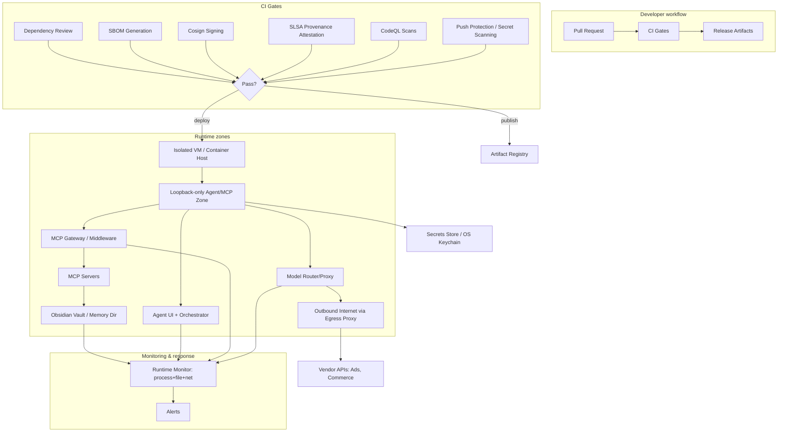

# Security hardening and detection for local agent platforms and MCP servers

## Executive summary

Local-first agent platforms and MCP servers shift risk from “cloud compromise” to a **high‑privilege local attack surface**: a combination of localhost network endpoints, filesystem access, tool/plugin execution, and large numbers of long‑lived API tokens. This mix can turn a single misconfiguration or supply‑chain event into broad local compromise. citeturn11view0turn10view0turn0search1turn9search3

The **OpenClaw/MoltBot** ecosystem illustrates how quickly this risk compounds. A high‑severity issue (CVE‑2026‑25253) allowed **authentication token exfiltration via a crafted `gatewayUrl`**, leading to “full gateway compromise” and “1‑click RCE,” and was explicitly described as exploitable **even when the gateway binds to loopback**, because the victim’s browser bridges the connection. citeturn11view0 Concurrently, the ecosystem experienced intense **supply‑chain pressure**, including an impersonation campaign (typosquat domains + cloned repo) after renames citeturn0search1 and a widely reported npm incident in which an unauthorized release of Cline CLI installed OpenClaw globally via a `postinstall` hook. citeturn10view0turn9search3turn0search2turn0search3

Across the “interop stack” projects you flagged (OpenWork, MetaMCP, meta-ads-mcp, Open Deep Research, Claude Code Router, EchoVault, TurboVault, obsidian-mcp-server), the dominant pattern is **functional capability outrunning explicit security posture**: many repos have **no SECURITY.md and no published advisories** on their GitHub Security pages, even when they handle powerful credentials or offer write-capable tools. citeturn5view0turn6view1turn6view2turn6view4turn6view5turn6view6turn8view0 The most defensible approach is to assume every agent/tooling component is “potentially hostile,” then enforce safety with **hard deployment guardrails**: loopback-only access, container/VM sandboxing, strict tool filtering, least-privilege OAuth, and continuous supply‑chain and runtime detection (SBOM + signing + dependency review + secrets protection + CodeQL + container scanning + provenance attestations). citeturn0search4turn12search7turn3search2turn4search0turn4search9turn3search7turn4search1turn4search5

## Attack surface inventory for local agent platforms and MCP servers

A useful mental model is: **agents are local “mini control planes.”** Even if the LLM is cloud-hosted, the attack surface is local and privileged: endpoints on localhost, local files, environment secrets, and plugins/tools. citeturn11view0turn2search2turn12search0

### Network attack surface

Local agents and MCP servers frequently expose:
- **Local HTTP/SSE endpoints and WebSockets** for control UIs, gateways, or server transports.
- **CORS/CSRF-style browser-origin risks** when a UI is web-based or interacts with a local service.
- **SSRF and internal network reachability** if tools include “fetch” or network access.

Two concrete examples from recent advisories:

- **OpenClaw Control UI token exfiltration**: GitHub-reviewed advisory for **CVE‑2026‑25253** states the UI “trusts `gatewayUrl` from the query string without validation and auto-connects on load,” sending the stored gateway token; a crafted link can exfiltrate the token and enable “1-click RCE,” explicitly **working even with loopback gateway binding** because the browser bridges outward. citeturn11view0  
- **Claude Code Router CORS**: a GHSA describes improper CORS configuration that could expose user API keys/credentials to untrusted domains, enabling quota exhaustion or sensitive access. citeturn9search2turn9search21

### Filesystem and workspace attack surface

File access is a core feature of “local-first” agents and Obsidian/vault integrations. Risks include:
- **Path traversal / symlink traversal** escaping the intended workspace or vault directory.
- **Accidental exposure of credential files** (`~/.ssh`, cloud credentials, browser profiles, `.env`, token caches).
- **Destructive writes** if tools are write-capable (modify/delete/rename).

OpenClaw’s advisory list includes multiple file and policy boundary issues, including “Avatar symlink traversal can expose out-of-workspace local files” and multiple allowlist/policy bypass themes. citeturn7view0

For Obsidian bridges specifically, `obsidian-mcp-server` requires a base URL + API key to access the vault via the Local REST API plugin, which is inherently a filesystem gateway; the repo notes encrypted (HTTPS) connectivity as the default mode. citeturn2search2

### Tool/plugin/skill execution surface

Tools, skills, and plugins are effectively **arbitrary code execution by design**. The relevant surfaces are:
- **Runtime execution** (shell, Python/Node, browser automation, or SDK calls).
- **Tool registries/marketplaces** (downloaded code from third parties).
- **Transitive dependencies** (npm/pip/cargo supply chain).

OpenClaw’s security posture explicitly recognizes the scale of this problem by requiring reproducible PoCs and emphasizing “trust boundaries” in reports. citeturn7view1

### OAuth/token leakage and credential misuse surface

Agent stacks tend to accumulate tokens for:
- Vendor APIs (Meta Ads, Shopify, Google, etc.)
- MCP middleware auth (API keys / OAuth)
- Model providers and routers (Anthropic/OpenRouter/etc.)
- Local app sessions (browser automation modes)

Meta’s own Marketing API authorization documentation notes that managing other people’s ad accounts typically requires advanced access to `ads_read` and/or `ads_management`. citeturn3search1 These are high-value permissions; leakage is costly and often hard to detect quickly in local experiments.

### Supply-chain and typosquat surface

Two recurring patterns appeared in early 2026 incidents:

- **Brand/rename typosquatting + cloned repos**: Malwarebytes documented an impersonation campaign following the Clawdbot → Moltbot rename, including typosquat domains and a cloned GitHub repository positioned for potential supply-chain abuse, emphasizing “the code is clean” while infrastructure is not. citeturn0search1  
- **Unauthorized package publishing and unexpected install hooks**: GitHub’s advisory for Cline CLI (GHSA‑9ppg‑jx86‑fqw7) describes a compromised npm publish token and a modified `postinstall` script that globally installs OpenClaw; it also highlights remediation and notes publishing moved to OIDC provenance in GitHub Actions. citeturn10view0

### CI/CD and container/VM escape surface

Even for “local” deployments, CI/CD often builds images or packages. Key risks:
- **Compromised CI tokens** pushing malicious releases (as with unauthorized publish incidents).
- **Unsigned artifacts** and missing provenance allowing tampering to go unnoticed.
- **Container breakout** if agents run with broad mounts, host networking, `--privileged`, or Docker socket access.

SLSA defines provenance as an in-toto attestation describing how an artifact was produced, and GitHub provides an action to generate signed provenance attestations. citeturn4search29turn4search5

### Attack surface mapping diagram

```mermaid
flowchart LR
  A[User / Operator] --> B[Agent UI / Desktop App]
  B --> C[Local Gateway / Control UI]
  B --> D[MCP Client]
  D --> E[MCP Middleware / Aggregator]
  E --> F[MCP Servers]
  F --> G[Filesystem / Vault]
  F --> H[Browser Automation Runtime]
  F --> I[Network Fetch / Web]
  E --> J[OAuth / API Key Auth Layer]
  J --> K[Vendor APIs: Ads, Commerce]
  B --> L[Model Router / Proxy]
  L --> M[LLM Provider(s)]
  subgraph SupplyChain[Supply chain surfaces]
    N[Package registry: npm/pypi/cargo] --> B
    N --> E
    N --> F
    O[Plugin/Skill registry] --> F
  end
  subgraph Containers[Deployment isolation]
    P[Container/VM boundary] -. reduces blast radius .- C
    P -. reduces blast radius .- E
    P -. reduces blast radius .- F
  end
```

## Recent vulnerability incidents and supply-chain compromises

This section emphasizes **primary sources** (GitHub advisories and vendor/security research writeups) and uses concrete timestamps relative to the current date (Feb 23, 2026 America/New_York).

### OpenClaw/Clawdbot/Moltbot: 1-click RCE via token exfiltration

GitHub Advisory Database entry for **CVE‑2026‑25253 / GHSA‑g8p2‑7wf7‑98mq** describes a high-severity issue published Jan 31, 2026 (updated Feb 2, 2026) affecting versions **≤ 2026.1.28**, patched in **2026.1.29**. The advisory explains that the Control UI auto-connects to a `gatewayUrl` from the query string and sends a stored gateway token; token exfiltration can lead to “full gateway compromise,” including modifying sandbox/tool policies and invoking privileged actions, and is stated to be exploitable even with loopback binding. citeturn11view0

### OpenClaw: high advisory volume and breadth of bypass classes

As of Feb 23, 2026, the OpenClaw repository’s GitHub Security UI shows a large volume of advisories (“Security 162”), and the advisories list includes multiple policy/allowlist bypasses, SSRF guard weaknesses, and filesystem boundary issues—many published Feb 23, 2026 (e.g., safeBins allowlist bypasses, symlink traversal exposure, SSRF blocking incompleteness). citeturn7view0

### Cline CLI supply-chain incident: unauthorized publish installs OpenClaw globally

GitHub-reviewed advisory **GHSA‑9ppg‑jx86‑fqw7** states that on **Feb 17, 2026 at 3:26 AM PT**, an attacker used a compromised npm publish token to publish `cline@2.3.0` with a `postinstall` script that installed OpenClaw globally; `cline@2.4.0` was published at 11:23 AM PT and `2.3.0` deprecated at 11:30 AM PT, and the advisory notes npm publishing moved to **OIDC provenance via GitHub Actions**. citeturn10view0

Independent monitoring writeups corroborate the event and provide additional operational detail—StepSecurity reports detecting the suspicious release at **11:40 UTC** on Feb 17, 2026 and reports ~4,000 downloads before deprecation. citeturn9search3 Endor Labs similarly describes the compromised release and references the tracking GHSA. citeturn0search3

### Rename-driven impersonation and typosquat infrastructure

Malwarebytes’ threat intel writeup (Jan 29, 2026) describes an impersonation campaign after the rename of Clawdbot to Moltbot, including typosquat domains and a cloned GitHub repository impersonating the creator, positioned as potential supply-chain infrastructure. The writeup highlights a common pattern: users install a “legitimate-looking” project and then add API keys/tokens, establishing trust that attackers can later exploit. citeturn0search1

### Broader “unexpected OpenClaw installation” coverage

CSO Online reported in Feb 2026 that a compromised npm package silently installs OpenClaw and highlighted the technique’s implications for agents that can have broad system access, even if the agent itself isn’t directly weaponized in the reported incident. citeturn0search2

## Hardening controls and gaps across projects

This section evaluates how each project approaches security hardening (or fails to), focusing on sandboxing, loopback binding, authentication, tool scoping, and vulnerability history. Where a control is not documented in sources, it is marked **unspecified**.

### OpenClaw / MoltBot family

OpenClaw ships with a comparatively mature security framework: a published security policy with triage gates and explicit differentiation between “prompt injection only” reports vs. boundary bypasses. citeturn7view1 The project also recommends loopback-only gateway binding by default (`gateway.bind="loopback"`) and treats disabling device auth as a localhost-only break-glass configuration that should be surfaced by `openclaw security audit` as dangerous. citeturn0search4

However, the primary lesson from CVE‑2026‑25253 is that **loopback binding alone is not sufficient** when a browser-accessible UI can be induced to connect outward and leak a gateway token. citeturn11view0 In practice, OpenClaw should be treated as a **high-hardening-level** component: run isolated (VM/container), block inbound access, minimize outbound, and treat plugin/skill installation like running third-party code.

### MetaMCP as an MCP “gateway”

MetaMCP provides multiple security-relevant controls at the middleware layer:

- **Environment variable interpolation** for server configuration allows secrets to be referenced as `${ENV_VAR}` rather than embedded. citeturn12search0  
- **Tool management and filtering**: the docs describe tool enable/disable per namespace and filtering inactive tools from listings, which is both a security control (least privilege) and a cost control (reduces tool overload). citeturn12search7  
- **Authentication**: docs describe operating with both API keys and OAuth bearer tokens, including precedence rules; the GitHub repo also recommends API key usage via `Authorization: Bearer <API_KEY>` as best practice. citeturn12search2turn12search1  

Despite these capabilities, MetaMCP’s GitHub Security page shows **no SECURITY.md and no published advisories** at the time of this report, so the operational burden is on deployers to harden and monitor. citeturn6view1

### OpenWork as a local-first UI wrapper

OpenWork’s README includes explicit “Security Notes,” stating that it hides model reasoning and sensitive tool metadata by default and that host mode binds to `127.0.0.1` by default. citeturn1search1 Its GitHub Security page currently indicates no SECURITY.md and no published advisories. citeturn5view0

Interpretation: OpenWork is plausibly safer than agent systems that default-bind to LAN, but it is still a control plane for tools; isolation and secrets discipline remain necessary.

### Open Deep Research as a “research agent” framework

The project’s GitHub Security page includes a security policy emphasizing that LangChain integrations can access local/remote filesystems and external APIs and recommends least-privilege, sandboxing (containers), proxy control for requests, and defense-in-depth. citeturn8view0 The same page indicates no published advisories at this time. citeturn8view0

Implication: Open Deep Research is best deployed as a **restricted worker**: read-only credentials where possible, tightly scoped filesystem access, and a controlled network egress policy.

### Claude Code Router as a model-routing proxy

Claude Code Router documents a defensive default: if `APIKEY` is not set, the server host is forced to `127.0.0.1` to prevent unauthorized access. citeturn1search7 Its GitHub Security page lists an advisory “claude-code-router CORS” (GHSA‑8hmm‑4crw‑vm2c). citeturn6view3 The GHSA describes credential exposure risk from improper CORS and notes patching in v1.0.34 in the GitHub advisory database entry. citeturn9search21

Operationally, treat routers/proxies as **credential concentrators**: lock them to loopback, set an API key, disable permissive CORS, and monitor for unusual inbound requests.

### Obsidian memory and vault MCP servers

- EchoVault explicitly claims **Obsidian compatibility**, storing session files as Markdown with YAML frontmatter in a local vault directory (e.g., `~/.memory/vault/`). citeturn2search0 Its GitHub Security page shows no security policy and no published advisories. citeturn6view4  
- TurboVault describes itself as a production-grade MCP server offering **44 specialized tools** for reading/writing/searching/managing notes, built in Rust and optimized for performance. citeturn2search1 Its GitHub Security page shows no security policy and no published advisories. citeturn6view5  
- obsidian-mcp-server requires `OBSIDIAN_BASE_URL` and `OBSIDIAN_API_KEY` and notes the Obsidian Local REST API plugin’s encrypted (HTTPS) default connection mode, making it a clear “vault API gateway.” citeturn2search2 Its GitHub Security page shows no security policy and no published advisories. citeturn6view6  

The key risk with “Obsidian memory” is not only exfiltration, but silent contamination: attackers or compromised tools can write misleading notes, inject instructions, or stage future execution via content that later influences an agent.

### Meta Ads MCP server

The meta-ads-mcp repository is explicitly an MCP server for interacting with Meta Ads and operating campaigns/insights through an AI interface. citeturn2search3 Its GitHub Security page shows no SECURITY.md and no published advisories. citeturn6view2

Because Meta Marketing API access for third-party account management often requires advanced access to permissions like `ads_read` and/or `ads_management`, token protection is a first-order requirement. citeturn3search1

### OpenClaude and related clients, plus legacy ClaudeBot/MothBot

- Open Claude Cowork describes itself as a desktop app powered by Claude Agent SDK and a tool router; its GitHub Security page shows no SECURITY.md and no published advisories. citeturn14search5turn14search1 It also includes a security warning in its browser mode documentation that the assistant can access open tabs and logged‑in sessions and should only be used with trusted sites. citeturn14search9  
- open-claude’s GitHub Security page similarly shows no SECURITY.md and no published advisories. citeturn14search2 Its README notes it authenticates through the official web login and does not bypass auth controls, but that still implies local session-handling risk. citeturn14search6  
- ClaudeBot (Hubot-era) is an IRC bot instance of Hubot, historically configured for Heroku deployment and migrating plans; this is primarily legacy ChatOps code rather than a modern agent platform. citeturn14search0turn14search4  
- MothBot examples are Discord/ML bots that require putting a token into a `.env` file and running locally; they are not agent platforms but demonstrate routine token-handling pitfalls. citeturn14search3  

### Summary table by project

| Project | Known advisories/incidents | Recommended hardening level | Sandboxing support | Suggested runtime detection controls |
|---|---|---|---|---|
| OpenClaw (MoltBot family) | **Yes**: CVE‑2026‑25253 (1‑click token exfil → gateway compromise) citeturn11view0; large advisory volume citeturn7view0; supply-chain pressure: impersonation campaign citeturn0search1; “unexpected install” incident linkage via Cline advisory citeturn10view0 | High | Partial (policy/allowlist features exist but bypass advisories show limits) citeturn7view0turn0search4 | Egress allowlisting, outbound domain alerts, process-spawn monitoring (shell/tools), workspace integrity/FIM, token usage anomaly detection |
| MetaMCP | No published advisories on GitHub Security page citeturn6view1 | Medium → High (depends on what it proxies) | Partial (tool filtering/namespace controls) citeturn12search7 | Auth failures and token misuse alerts; tool invocation audits; anomaly detection: unusual tool enumeration + large tool lists |
| meta-ads-mcp | No published advisories on GitHub Security page citeturn6view2 | High (handles Ads tokens) | No (deploy-time) | Token access monitoring; outbound call rate thresholds; restrict to read-only where possible; secrets scanning |
| OpenWork | No published advisories; no security policy on Security page citeturn5view0 | Medium | No (deploy-time) | Network bind checks (loopback), command execution monitoring, secrets leak prevention in logs |
| Open Deep Research | Security policy present; no published advisories citeturn8view0 | Medium | No (framework; recommends sandboxing) citeturn8view0 | Restrict filesystem dirs, proxy outbound, monitor tool usage, prevent write-capable credentials |
| Claude Code Router | **Yes**: GHSA‑8hmm‑4crw‑vm2c (CORS key/credential leakage risk) citeturn9search21turn6view3 | Medium → High (credential concentrator) | No (deploy-time) | HTTP access logs + alert on non-local origins; enforce API key; detect unexpected browsers hitting router |
| EchoVault | No published advisories; no security policy citeturn6view4 | Medium (sensitive memory store) | No | File integrity of vault, redact secrets detection in markdown, backup + tamper detection |
| TurboVault | No published advisories; no security policy citeturn6view5 | Medium → High (44 write-capable tools) citeturn2search1 | No | Vault directory confinement validation; audit every write tool call; detect mass edits and note deletions |
| obsidian-mcp-server | No published advisories; no security policy citeturn6view6 | Medium → High (vault API gateway) | Partial (depends on REST plugin/auth) citeturn2search2 | API key protection; alert on access outside expected client; vault path access audit |
| Open Claude Cowork / open-claude | No published advisories; no security policy citeturn14search1turn14search2 | Medium | No | Browser automation mode: monitor for cookie/session access; isolate profile; restrict sites citeturn14search9 |
| ClaudeBot / MothBot (legacy) | Unspecified advisories; primarily legacy bot code and token-in-.env patterns citeturn14search0turn14search3 | Low → Medium | No | Basic secret scanning + dependency maintenance; isolate runtime; rotate tokens |

## Detection tooling and CI checks for agent/MCP projects

Most agent stacks benefit from combining **pre-merge prevention** (code scanning, dependency review, secret blocking) with **post-build integrity controls** (SBOM + signing + provenance) and **runtime monitoring** (process + filesystem + network). The controls below are widely applicable to both “agent platforms” and MCP servers.

### Supply-chain and dependency controls

**Dependabot** can maintain version updates via `dependabot.yml` and uses manifest locations to check for outdated packages using semver. citeturn3search2turn3search10 You can also configure Dependabot to keep GitHub Actions dependencies updated. citeturn3search13

**Dependency review** can block PRs that introduce known vulnerable dependencies; GitHub documents the dependency review action and associated enforcement workflows. citeturn13search2turn13search6

**OpenSSF Scorecard** provides repository-level posture checks and offers an official GitHub Action. citeturn13search3turn13search7

### Secret detection and leak prevention

GitHub’s **push protection** is designed to prevent secrets/tokens from being pushed in the first place by scanning during push and blocking if a secret is detected, rather than only alerting after commit. citeturn4search0turn4search3

For agent/MCP repos, this is especially important because `.env`, config JSON, and cached tokens are common.

### Static analysis and workflow scanning

GitHub’s CodeQL-based code scanning can be enabled via default or advanced setup; after enabling CodeQL, GitHub Actions executes workflow runs to scan code. citeturn4search9turn4search21 GitHub also notes CodeQL support for scanning GitHub Actions workflows themselves, helping detect dangerous patterns in CI. citeturn4search24

### SBOM, signing, and provenance attestations

**Syft** generates an SBOM from container images and filesystems. citeturn3search3 **anchore/sbom-action** runs Syft and uploads an SPDX-format SBOM artifact (and can attach SBOM to releases). citeturn3search7

**Cosign** (Sigstore) supports keyless signing using Fulcio and Rekor and can sign OCI artifacts. citeturn4search1turn4search25

**Trivy** documents an example flow where Trivy generates a CycloneDX SBOM and Cosign attaches an attestation of the SBOM to a container image. citeturn3search14

For provenance, GitHub’s `actions/attest-build-provenance` action generates signed build provenance attestations using the in-toto format; SLSA defines provenance as an attestation describing how an artifact was produced. citeturn4search5turn4search29

## Deployment guardrails, CI/CD configurations, and runtime monitoring

This section provides concrete configurations (CI snippets + runtime rules). Replace placeholder values and keep secrets out of git.

### Hardened deployment architecture diagram



### CI/CD configurations

#### Dependabot configuration

Dependabot configurations are defined in `.github/dependabot.yml`. citeturn3search2turn3search10turn3search16

```yaml
version: 2
updates:
  - package-ecosystem: "npm"
    directory: "/"
    schedule:
      interval: "weekly"
    open-pull-requests-limit: 10
    groups:
      security-updates:
        applies-to: "security-updates"
        patterns:
          - "*"

  - package-ecosystem: "pip"
    directory: "/"
    schedule:
      interval: "weekly"

  - package-ecosystem: "github-actions"
    directory: "/"
    schedule:
      interval: "weekly"
```

Keeping actions updated is supported by Dependabot with `package-ecosystem: "github-actions"` and `directory: "/"`. citeturn3search13

#### Dependency review action

The dependency review action scans PR dependency diffs and can fail builds if new vulnerable dependencies are introduced. citeturn13search2turn13search6

```yaml
name: dependency-review
on:
  pull_request:

permissions:
  contents: read

jobs:
  dependency-review:
    runs-on: ubuntu-latest
    steps:
      - uses: actions/checkout@v4
      - uses: actions/dependency-review-action@v4
        with:
          fail-on-severity: high
```

#### CodeQL scanning

GitHub documents using CodeQL via default or advanced setup; CodeQL runs in GitHub Actions once enabled. citeturn4search9turn4search30

```yaml
name: codeql
on:
  push:
    branches: ["main"]
  pull_request:
    branches: ["main"]

permissions:
  security-events: write
  contents: read

jobs:
  analyze:
    runs-on: ubuntu-latest
    steps:
      - uses: actions/checkout@v4
      - uses: github/codeql-action/init@v3
        with:
          languages: "python,javascript"
      - uses: github/codeql-action/analyze@v3
```

#### SBOM generation with Syft

Syft is an SBOM generator for images and filesystems, and `anchore/sbom-action` runs Syft and uploads an SPDX SBOM artifact. citeturn3search3turn3search7

```yaml
name: sbom
on:
  push:
    tags: ["v*"]

permissions:
  contents: write

jobs:
  sbom:
    runs-on: ubuntu-latest
    steps:
      - uses: actions/checkout@v4
      - uses: anchore/sbom-action@v0
        with:
          format: spdx-json
          output-file: sbom.spdx.json
```

#### Signing and provenance attestations

Cosign supports keyless signing and Sigstore documents SCM integration; GitHub provides a provenance attestation action bound to SLSA provenance (in-toto). citeturn4search1turn4search25turn4search5turn4search29

```yaml
name: sign-and-attest
on:
  push:
    tags: ["v*"]

permissions:
  contents: read
  packages: write
  id-token: write
  attestations: write

jobs:
  sign:
    runs-on: ubuntu-latest
    steps:
      - uses: actions/checkout@v4

      - name: Build and push image
        run: |
          echo "Build/push steps go here"
          echo "Set IMAGE_DIGEST output from your registry push step"

      - name: Install cosign
        uses: sigstore/cosign-installer@v3

      - name: Sign image (keyless)
        run: |
          cosign sign --yes "${IMAGE_REF}@${IMAGE_DIGEST}"

      - name: Attest build provenance
        uses: actions/attest-build-provenance@v2
        with:
          subject-name: "${IMAGE_REF}"
          subject-digest: "${IMAGE_DIGEST}"
          push-to-registry: true
```

### Container/image scanning commands

Trivy documents `trivy image <image>` as the basic container image scan command. citeturn13search0turn13search18 Grype supports scanning images, filesystems, and SBOMs. citeturn13search5turn13search22

Suggested release gate (example):

```bash
# Scan built image
trivy image --severity HIGH,CRITICAL --ignore-unfixed "${IMAGE_REF}@${IMAGE_DIGEST}"

# Generate SBOM and scan via Grype (SBOM-driven)
syft "${IMAGE_REF}@${IMAGE_DIGEST}" -o json > sbom.syft.json
grype sbom:sbom.syft.json --fail-on high
```

If you want SBOM attestations: Trivy documents generating a CycloneDX SBOM and attaching an attestation with Cosign. citeturn3search14

### Runtime monitoring rules and alert thresholds

Below are actionable, agent-specific runtime detections. These are recommended guardrails; exact thresholds are environment-dependent (**thresholds are not specified in sources**).

**Process and syscall monitoring (high signal for agents):**
- Alert on agent process spawning:
  - `bash`, `sh`, `zsh`, `powershell`, `cmd.exe`
  - package managers (`npm`, `pip`, `curl`, `wget`)
  - compilers/build tools if not expected
- Alert on filesystem reads of:
  - `~/.ssh/*`, `~/.gnupg/*`, cloud credential dirs, browser profile dirs
  - `.env`, `.npmrc`, `.pypirc`, `.netrc`
- Alert on file writes outside an allowlisted set:
  - agent workspace directory
  - dedicated vault directory (Obsidian or EchoVault)
- Alert on mass write/delete behavior:
  - >50 file writes within 5 minutes
  - any delete/rename outside workspace/vault

**Network monitoring:**
- Enforce loopback binding for all control planes when possible:
  - OpenWork explicitly notes host mode default bind to `127.0.0.1`. citeturn1search1  
  - Claude Code Router forces host to `127.0.0.1` if no APIKEY is set. citeturn1search7  
  - OpenClaw recommends loopback-only gateway binding by default. citeturn0search4  
- Alert on outbound connections to:
  - newly registered domains
  - non-standard ports
  - direct IP literals (common in staged exfil/command channels)
- For browser-automation modes (e.g., “assistant can access open tabs/sessions”), alert on:
  - cookie store access anomalies
  - new destinations accessed via automation that aren’t on an allowlist citeturn14search9

**Token usage anomaly detection:**
- Meta Ads tokens:
  - alert on unusual spikes in calls (e.g., >X calls/minute)
  - alert on calls to write endpoints if you intend read-only usage (requires endpoint-level logging in your MCP server)
  - remember `ads_read`/`ads_management` are high-value permissions requiring advanced access in some cases citeturn3search1

### Incident response playbook for agent stacks

These steps are designed around the real-world incidents documented in early 2026 (impersonation + unauthorized installs).

1. **Quarantine**: disconnect the agent VM/container from the network; preserve disk snapshot.
2. **Credential rotation**: rotate vendor tokens, model keys, and MCP API keys; assume leakage if a Control UI token was ever stored in a browser and a “gateway URL trust” issue existed. citeturn11view0
3. **Verify installation integrity**:
   - check global installs for unexpected packages (mirrors the Cline incident’s mitigation guidance). citeturn10view0
4. **Audit tool/plugin inventory**:
   - remove newly added MCP servers/tools and re-add from verified sources only (rename/impersonation campaigns explicitly target this step). citeturn0search1
5. **SBOM + diff**:
   - compare SBOMs against last-known-good; scan with Trivy/Grype. citeturn3search3turn13search0turn13search5
6. **Rebuild from clean provenance**:
   - require attested builds for redeploy (SLSA provenance). citeturn4search5turn4search29
7. **Add compensating controls**:
   - tool filtering, egress control, and push protection to prevent recurrence. citeturn12search7turn4search0

## Immediate actions checklist

Below is a concise top-10 “do this now” list tuned to local-first agents + MCP servers.

1. Enforce **loopback-only** binds for gateways, routers, and MCP endpoints unless behind a private network boundary. citeturn0search4turn1search7turn1search1  
2. Run agent platforms (especially OpenClaw-family) inside a **dedicated VM** (not your primary workstation) with no admin/root by default. citeturn11view0turn0search2turn0search1  
3. Put **all secrets in env vars/secret stores**, never in config files committed to git; adopt `${ENV_VAR}`-style config patterns where supported (MetaMCP). citeturn12search0  
4. Scope OAuth/API tokens to **least privilege**, starting with read-only where possible; treat Ads permissions (`ads_read`/`ads_management`) as high value. citeturn3search1  
5. Add **tool filtering** at the gateway/middleware layer (MetaMCP namespaces) to remove dangerous tools from the model’s reachable set. citeturn12search7  
6. Enable **push protection** (secret scanning) to prevent token leaks at commit time. citeturn4search0turn4search3  
7. Require **dependency review** on PRs and block merges that introduce vulnerable dependencies. citeturn13search2turn13search6  
8. Turn on **CodeQL scanning** (including workflow scanning where relevant) to catch insecure patterns early. citeturn4search9turn4search24  
9. Generate and publish **SBOMs**, then scan images/SBOMs with Trivy/Grype in CI gates. citeturn3search3turn3search7turn13search0turn13search5  
10. Sign and attest releases (**Cosign + provenance attestations**) so users can detect tampering and you can detect sudden disappearance of attestations (a noted signal in supply-chain writeups). citeturn4search1turn4search5turn10view0